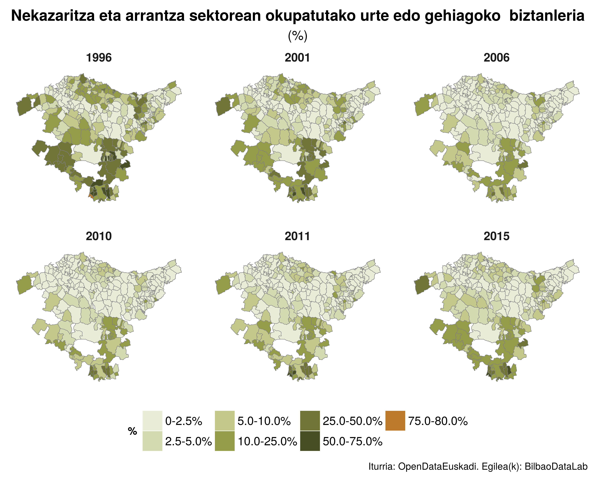

Udalmap-r-maps
=============

Biltegi honetan R erabiliz Udalmapetik adierazleak jaitsi eta irudikatzeko pausuak aurkituko dituzu.

In this repository you will find the steps to download and visualise the indicators from Udalmap using R.

Este repositorio incluye los pasos para descargar y visualizar los indicadores de udalmap utilizando R.

___

| Resource | Source | Description |
| --- | --- | --- |
| Data | [Udalmap](http://www.eustat.euskadi.eus/t35-udalmap/en/contenidos/informacion/udalmap/en_udalmap/udalmap.html) | Udalmap is an Municipal information system. The purpose of Udalmap is to know with detail the reality in the municipalities of the Autonomous Comunity of the Basque Country. |
| Maps | [Gaindegia](http://www.euskalgeo.net) | Gaindegia is an observatory dedicated to promoting knowledge and opinion on Euskal Herria's economy and society among its economic and social agents. |

Here you will find the **R** script to download and visualise all the indicators from **Udalmap**. However, a shapefile provided by **Euskalgeo** has been used as a base layer for the map. The **ggplot** package has been used to complete the visualisation.

The script *udalmap.R* works as follows:
  1. Download indicators from udalmap.
  2. Download shp from euskalgeo.
  3. Standarise town names in database and map.
  4. Reduce map to places included in udalmap. Add data to the map.
  5. Group indicators by type (%, €, index, m²) to range the values properly.
  6. Plot each indicator by years.

In the *udalmap* folder you will find the whole process split up in different files, as it was used in the [BilbaoDataLab 4th session](http://bilbaodatalab.wikitoki.org/2016/12/05/puesta-en-marcha-en-r-y-mapas-con-datos-de-udalmap/ "BilbaoDataLab 4th session"), in order to make it easier to understand.

Output Example
--------------

In the *out* folder you will find this example indicator in Basque, Spanish and English.
